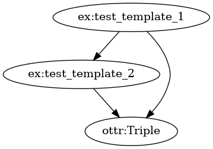
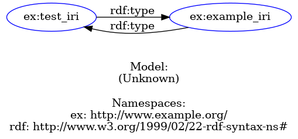

# OTTR Viz: Reasonable Ontology Template Visulaization

## Installation
Requires Python >= 3.6

1. clone
2. navigate into the main directory by `cd ottr_viz/`
3. install all python requirements with `pip install .`
4. install the additional requirements depending on the tools you use

## Viz OTTR Library

### Additional dependencies
* [Graphviz](https://graphviz.org/), install with `sudo apt-get install graphviz graphviz-dev` if not already installed

### Example:
With `python viz_ottr_library.py -format png data/pattern_library.stottr` you can generate the following visualization:

## Viz OTTR Instances

### Additional dependencies
* [Lutra](https://gitlab.com/ottr/lutra/lutra)
* [Raptor RDF Syntax Library](https://librdf.org/raptor/)

### Example:
With `python viz_ottr_instances.py ./data/ottr_instances/ ./data/pattern_library.stottr` you can generate the following visualization:

